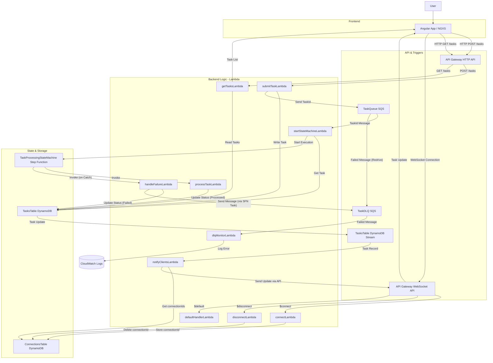

# High-Level Architecture Diagram

**Flow Description:**

1.  **Task Submission**: Frontend sends task details to API Gateway (HTTP), triggering `submitTaskLambda`. This Lambda saves the task (status: Pending) to DynamoDB and sends the `taskId` to SQS.
2.  **Task Fetching**: Frontend requests tasks from API Gateway (HTTP), triggering `getTasksLambda`, which scans DynamoDB.
3.  **Processing Start**: SQS triggers `startStateMachineLambda`, which fetches task details from DynamoDB and starts the Step Function execution (task remains Pending).
4.  **Step Function Execution**: The Step Function invokes `processTaskLambda`. 
5.  **Success**: `processTaskLambda` updates DynamoDB status to Processed.
6.  **Failure/Retry**: If `processTaskLambda` fails (simulated 30% chance), Step Function retries based on the policy. After retries, it invokes `handleFailureLambda` via the Catch block, which updates DynamoDB status to Failed. The Step Function then explicitly sends a message containing failure details to the TaskDLQ.
7.  **DLQ Handling**: Messages arrive in the DLQ via two paths: (a) the SQS redrive policy if initial processing via `startStateMachineLambda` fails repeatedly, or (b) explicitly sent by the Step Function after exhausting retries in the main processing flow. The DLQ triggers `dlqMonitorLambda` for logging.
8.  **WebSocket Connection**: Frontend connects via API Gateway (WebSocket). `$connect` and `$disconnect` routes trigger Lambdas to manage connection IDs in a separate DynamoDB table.
9.  **Real-time Updates**: DynamoDB Streams on the tasks table capture item modifications. This triggers `notifyClientsLambda`, which fetches all active connection IDs and pushes the updated task data to connected clients via the WebSocket API. 